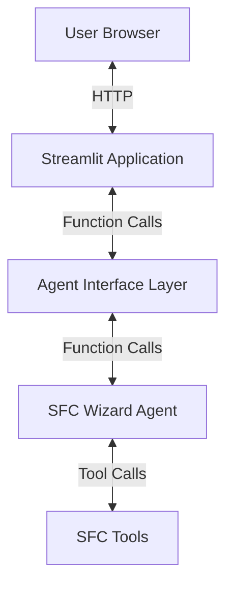

# Design Document

## Overview

The UI Interface for the SFC Wizard Agent will be implemented using Streamlit, a Python library for creating web applications with minimal effort. This design focuses on creating a clean separation between the UI layer and the existing agent functionality, ensuring that we don't modify any existing code while providing a rich, interactive experience for users.

Streamlit is an excellent choice for this project because:
1. It's Python-based, aligning with the existing codebase
2. It requires minimal frontend development expertise
3. It has built-in components for chat interfaces, JSON viewers, and visualizations
4. It handles the web server and client-side rendering automatically
5. It's designed for data-focused applications, which aligns with SFC's purpose

## Architecture

The architecture follows a simplified approach with the following components:

1. **Streamlit Application**
   - Provides the web UI and handles user interactions
   - Renders UI components (chat, JSON viewers, visualizations)
   - Manages the web server functionality automatically

2. **Agent Interface Layer**
   - A new module that acts as a bridge between Streamlit and the SFC Wizard Agent
   - Translates Streamlit interactions into agent commands
   - Formats agent responses for display in the UI

3. **SFC Wizard Agent (Existing)**
   - The core agent functionality remains unchanged
   - All existing tools and capabilities are preserved

Here's a diagram of the architecture:



## Components and Interfaces

### Streamlit UI Components

1. **Chat Interface**
   - `st.chat_input()` for message input
   - `st.chat_message()` for conversation history display
   - `st.spinner()` for loading indicators
   - Native markdown rendering for formatted responses

2. **Configuration Viewer/Editor**
   - `st.json()` for JSON display with syntax highlighting
   - `st.code()` with JSON editing capabilities
   - `st.download_button()` for downloading configurations
   - Custom validation feedback using `st.error()`

3. **Visualization Display**
   - Native Streamlit plotting capabilities (`st.pyplot()`, `st.plotly()`)
   - `st.graphviz_chart()` for displaying graphs and diagrams
   - Built-in interactivity for visualizations
   - `st.download_button()` for exporting visualizations

4. **Navigation and Layout**
   - `st.sidebar` for navigation and controls
   - Responsive design handled by Streamlit
   - `st.tabs()` for organizing different features
   - `st.expander()` for collapsible sections

## Data Models

### Message Model

```python
class Message:
    id: str  # Unique identifier
    role: str  # "user" or "agent"
    content: str  # Message content (can include markdown)
    timestamp: datetime  # When the message was sent
    attachments: List[Attachment]  # Optional attachments (configs, visualizations)
```

### Attachment Model

```python
class Attachment:
    id: str  # Unique identifier
    type: str  # "config", "visualization", "log", etc.
    content: Any  # The attachment content
    metadata: Dict  # Additional information about the attachment
```

### Configuration Model

```python
class Configuration:
    id: str  # Unique identifier
    name: str  # Configuration name
    content: Dict  # The JSON configuration
    valid: bool  # Whether the configuration is valid
    validation_errors: List[ValidationError]  # Any validation errors
```

### Visualization Model

```python
class Visualization:
    id: str  # Unique identifier
    type: str  # "chart", "graph", "diagram", etc.
    data: Any  # The visualization data
    options: Dict  # Visualization options
```

## Error Handling

1. **Client-Side Error Handling**
   - Input validation before sending to server
   - Graceful degradation when server is unavailable
   - Clear error messages for user actions

2. **Server-Side Error Handling**
   - Structured error responses with status codes
   - Detailed error messages for debugging
   - Logging of errors for troubleshooting

3. **Agent Interface Error Handling**
   - Timeout handling for long-running operations
   - Graceful handling of agent failures
   - Recovery mechanisms for interrupted operations

## Testing Strategy

1. **Unit Testing**
   - Test individual UI components in isolation
   - Test server endpoints with mocked agent responses
   - Test agent interface functions with mocked agent

2. **Integration Testing**
   - Test UI components working together
   - Test server endpoints with real agent responses
   - Test end-to-end flows with simulated user actions

3. **Compatibility Testing**
   - Test on different browsers (Chrome, Firefox, Safari)
   - Test on different devices (desktop, tablet, mobile)
   - Test with different screen sizes and resolutions

## Implementation Considerations

### Technology Stack

1. **Streamlit**
   - Streamlit for the web application framework
   - Streamlit session state for maintaining conversation history
   - Streamlit components for custom UI elements (if needed)
   - Streamlit theming for consistent visual appearance

2. **Additional Libraries**
   - Pandas for data manipulation (already used by Streamlit)
   - Plotly for interactive visualizations
   - Graphviz for diagram generation
   - JSON Schema for configuration validation

### Performance Considerations

1. **Session Management**
   - Use Streamlit session state efficiently to maintain conversation context
   - Implement caching for expensive operations using `@st.cache_data`
   - Optimize large data transfers between the agent and UI

2. **Responsiveness**
   - Use Streamlit's async capabilities for long-running operations
   - Implement progress indicators for time-consuming tasks
   - Break complex UI updates into smaller chunks

3. **Resource Usage**
   - Monitor memory usage, especially with large configurations
   - Implement pagination for large datasets
   - Clean up resources properly when the application terminates

### Security Considerations

1. **Input Validation**
   - Validate all user inputs before processing
   - Sanitize inputs to prevent injection attacks
   - Implement proper error handling for invalid inputs

2. **Authentication**
   - Consider adding basic authentication if needed
   - Implement session timeouts for security
   - Protect sensitive configuration data

3. **Local Operation**
   - By default, run Streamlit on localhost only
   - Provide clear documentation for secure deployment options
   - Warn users about security implications of exposing the UI publicly

### Deployment Considerations

1. **Development Mode**
   - Run with `streamlit run` for local development
   - Enable debug mode for detailed error messages
   - Use hot-reloading for rapid development

2. **Production Mode**
   - Deploy behind a reverse proxy for production use
   - Configure proper HTTPS for secure communication
   - Implement proper logging for production environments

## File Structure

```
sfc_wizard/
├── __init__.py
├── agent.py                  # Existing agent code (unchanged)
├── tools/                    # Existing tools (unchanged)
│   └── ...
├── ui/                       # New UI module
│   ├── __init__.py
│   ├── app.py                # Main Streamlit application
│   ├── interface.py          # Agent interface layer
│   ├── components/           # Custom UI components
│   │   ├── __init__.py
│   │   ├── chat.py           # Chat interface components
│   │   ├── config_editor.py  # Configuration editor components
│   │   └── visualizer.py     # Visualization components
│   ├── utils/                # Utility functions
│   │   ├── __init__.py
│   │   ├── formatting.py     # Response formatting utilities
│   │   └── session.py        # Session management utilities
│   └── assets/               # Static assets
│       ├── css/              # Custom CSS
│       └── img/              # Images
```

This design ensures that we can add the UI interface to the SFC Wizard Agent without modifying any existing code. The new UI module will be completely separate from the existing agent code, communicating with it through well-defined interfaces.